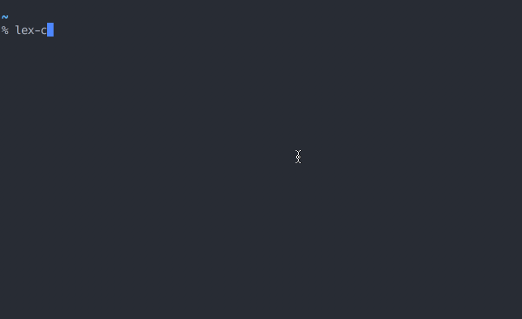
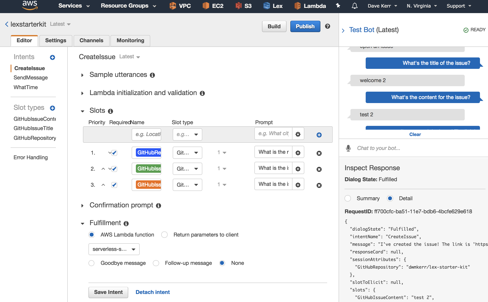

# Lex Starter Kit

[](https://circleci.com/gh/dwmkerr/lex-starter-kit) [](https://codecov.io/gh/dwmkerr/lex-starter-kit) [](https://www.guardrails.io) [](https://greenkeeper.io/)

> Build a chatbot with AWS Lex and Lambda in minutes!

This project is a starter kit quickly creating chatbox using AWS Lex and Lambda.
<!-- vim-markdown-toc GFM -->

* [Quick Start](#quick-start)
* [Developer Guide](#developer-guide)
    * [Environment Setup](#environment-setup)
    * [Deploying Changes](#deploying-changes)
    * [Useful Commands](#useful-commands)
    * [CI/CD](#cicd)
    * [Configuration and Environment Variables](#configuration-and-environment-variables)
* [Troubleshooting](#troubleshooting)
* [Useful Reading](#useful-reading)
* [Build a Chatbot in 10 Minutes](#build-a-chatbot-in-10-minutes)
* [The AWS Chatbot Challenge](#the-aws-chatbot-challenge)
* [TODO](#todo)
    * [Must](#must)
    * [Nice To Have](#nice-to-have)
    * [Publicising](#publicising)

<!-- vim-markdown-toc -->

# Quick Start

Have a bot up and running in seconds with:

```bash
aws configure
make setup
make deploy
```

Your bot is now running on AWS! You can use the [lex-chat](https://github.com/dwmkerr/lex-chat) tool to chat with the bot:

```bash
npm install -g lex-chat
```



You can see your bot in the [Lex Console](https://console.aws.amazon.com/lex/home):



# Developer Guide

The project structure is:

```
├── artifacts     # generated files/resources, not checked in
├── aws           # some aws resources used in setup
├── docs          # documentation/diagrams etc
├── lambda        # lambda function and tests
├── lex           # slots and intent json files
└── scripts       # scripts used by the makefile
``` 

## Environment Setup

Install:

- [The AWS CLI](https://aws.amazon.com/cli/)
- [jq](https://stedolan.github.io/jq/download/)

Ensure you are logged into the AWS CLI as a user with permissions to create Lambda Functions, Buckets, Roles, Policies and Lex Models.

## Deploying Changes

If you change the lambda function, environment variables for the lambda function, slots, intents or bot, just call:

```bash
make deploy

# ...or just deploy the code and variables...
make deploy-lambda

# ...or just deploy the lex models...
make deploy-lex
```

## Useful Commands

Here are some commands you can run to help work with the project:

| Command | Usage |
|---------|-------|
| `make lint` | Lints the code. |
| `make test` | Runs the unit tests. |
| `make rename-bot` | Renames the bot - run _before_ `make setup`. |
| `make setup` | Sets up your AWS resources. First time setup only. |
| `make build` | Builds the lamba function and zips it up locally. |
| `make deploy` | Deploys the code, slots and intents. |
| `make utterances` | Helper to print out all supported utterances. Useful when building docs. |
| `make check-dependencies` | Helper to check that the required tools are installed. |
| `make destroy` | Destroy the bot and associated resources. |

Note that for most scripts and `make` commands, you can get additional low-level information on what is happening by running setting `DEBUG=1`. For example:

```sh
$ DEBUG=1 make check-dependencies
debug: checking for aws cli...
debug: aws cli is installed
debug: checking for jq...
debug: jq is installed
```

If you are working on the code (in the [`./lambda/`](./lambda) folder, you can also use the commands below:

| Command | Usage |
|---------|-------|
| `npm test` | Test the code, also generating a coverage report .|
| `npm run test:debug` | Test the code, using the debugger. |
| `npm run lint` | Lint the code. |

## CI/CD

CircleCI is used for build pipelines. The pipeline is defined in [`.circleci/config.yml`](./circleci/config.yml), feel free to use it to build your own pipelines!

The pipeline will:

1. Lint the Code
2. Run Unit Tests
3. Build the Code
4. Create a Unit Test Coverage Report
5. Update the chatbot on AWS when any version tag (e.g. `v1.2.3` is pushed

## Configuration and Environment Variables

You can provide configuration to the lambda functions in the form of environment variables.

Check the [`lambda/config.js`](./lambda/config.js) file for an example, showing how the timezone provided in the [`makefile`](./makefile) is passed to the lambda function.

# Troubleshooting

Deploy never completes:

```
lexstarterkit build status is:
lexstarterkit build status is:
lexstarterkit build status is:
```

If this occurs, just cancel the deploy with `Ctrl+C`, then run `make deploy-lex` again.

# Useful Reading

- [Lambda and Lex - Input and Response Format](http://docs.aws.amazon.com/lex/latest/dg/lambda-input-response-format.html)
- https://docs.aws.amazon.com/lex/latest/dg/slack-bot-association.html

# Build a Chatbot in 10 Minutes

This project was built after developing my conference presentation [Build a Chatbot in 10 Minutes](https://www.slideshare.net/CodeOps/build-a-chatbot-in-ten-minutes-dave-kerr-serverless-summit).

If you want to see the exact version of the code which fits with the conference, including the versions of each of the different demos, just use the [`release/conference` branch](https://github.com/dwmkerr/lex-starter-kit/tree/release/conference).

However, the conference version is not being kept up to date, so I would recommend using this version from the `master` branch.

# The AWS Chatbot Challenge

This project was initially based on [lex-oscarbot](https://github.com/mindmelting/lex-oscarbot), a chatbot built for the [AWS Chatbot Challenge](https://aws.amazon.com/events/chatbot-challenge/) by [dwmkerr](https://github.com/dwmkerr), [mindmelting](https://github.com/mindmelting) and Selin Lanzafame.

# TODO

This is a simple task list of things I need to do to restructure and update the code.

## Must

- [x] Move check dependencies code to script
- [x] Document the usage of `DEBUG` for scripts and code
- [x] move setup into a script
- [x] Create a simple date intent with node
- [x] Create an intent with a built-in slot
- [x] Make sure we are showing how to use environment variables.
- [x] update nodejs code to 10x (async)
- [x] remove artifacts folder, generate as needed, remove checked in files (gunk)
- [x] move deploy into a script
- [x] clean out the old intents/slots/code
- [ ] move the generic lex javascript code into its own module
- [ ] Tutorial: A basic intent, no slots
- [ ] Tutorial: A basic intent, with a built-in slot
- [ ] Tutorial: A basic intent, with a custom slot
- [ ] Tutorial: A basic intent, with a default slot
- [ ] Tutorial: Session data

## Nice To Have

- [ ] docs: architecture diagram
- [ ] Allow the bot to easily be renamed
- [ ] Pass all lamba output to a log stream, so that the chat interface can also show logs consistently
- [ ] Rename bot should also rename the lambda function
- [ ] We should have a sample java lambda
- [ ] We should have a sample python lambda
- [ ] refactor: remove the 'setup' recipe, and on 'deploy' just check to see if the resources need to be created

## Publicising

- [ ] Blog Post
- [ ] Meet Up
- [ ] Another Conference
