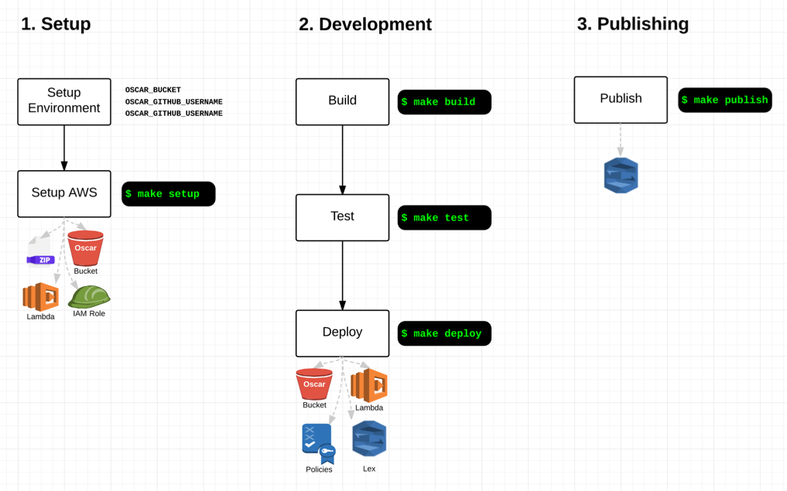

# lex-oscarbot [](https://circleci.com/gh/mindmelting/lex-oscarbot) [](https://codecov.io/gh/mindmelting/lex-oscarbot)

> Oscar is a sassy, connected chatbot who enables you to easily interact with GitHub projects, all out of Slack!

Check the [Quick Start Guide](https://docs.google.com/document/d/18Cson5ZFJicqecOh9l_enK-nn5m8zuAMgCh0P9tMzzI/edit?usp=sharing) to get access to Oscar on our Slack Channel - [oscar-bot.slack.com](http://oscar-bot.slack.com). Also check out [The AWS Chatbot Challenge](https://aws.amazon.com/events/chatbot-challenge/).

- [Quick Start](#quick-start)
- [Developer Guide](#developer-guide)
	- [Environment Setup](#environment-setup)
	- [Useful Commands](#useful-commands)
	- [Circle CI](#circle-ci)
	- [Snappy Responses](#snappy-responses)
	- [Useful Reading](#useful-reading)

# Quick Start

The fastest way to try out Oscar is to request an invite to the [OscarBot Slack Channel](https://oscar-bot.slack.com). Then checkout the [Quick Start Guide](https://docs.google.com/document/d/18Cson5ZFJicqecOh9l_enK-nn5m8zuAMgCh0P9tMzzI/edit?usp=sharing).

Oscar can provide all sorts of information about repositories, as well as doing things like opening issues. Some example interations are:

- "How many issues does {Repository} have?"
- "I would like to open an issue"
- "List the top issues for my project"

There's a more detailed list in the [Quick Start Guide]([Quick Start Guide](https://docs.google.com/document/d/18Cson5ZFJicqecOh9l_enK-nn5m8zuAMgCh0P9tMzzI/edit?usp=sharing)).

# Developer Guide

The project structure is:

```
├── aws           # some aws resources used in setup
├── docs          # internal docs/images
├── lex           # slots and intent json files
├── oscar-cli     # the oscar cli
├── oscarbot      # lamba function and tests
└── scripts       # scripts used by the makefile
```

This diagram shows the key steps for setup and development:



## Environment Setup

Install:

- [The AWS CLI](https://aws.amazon.com/cli/)
- [jq](https://stedolan.github.io/jq/download/)

Ensure you are logged into the AWS CLI as a user with permissions to create Lambda Functions, Buckets, Roles, Policies and Lex Models.

Set the following environment variables:

| Variable | Usage |
|----------|-------|
| `OSCAR_BUCKET` | A name to use for the S3 bucket for Oscar. This must be unique across AWS, so try something like `oscarbot-<your name>` |
| `OSCAR_GITHUB_USERNAME` | The GitHub user to login as when performing queries. |
| `OSCAR_GITHUB_PASSWORD` | The GitHub password to login with when performing queries. |
| `DEBUG=oscar` | Optional. Enables debug output (we use the [debug](https://www.npmjs.com/package/debug) module. |

You can now call:

```bash
make setup
```

Which will build the lambda function, bucket and policies.

## Deploying Changes

If you change the lambda function, slots, intents or bot, just call:

```bash
make deploy
```

This will rebuild the lambda function and redeploy it. It will also rebuild and publish all slots, intents and the bot.
``

## Useful Commands

Here are some commands you can run to help work with the project:

| Command | Usage |
|---------|-------|
| `make build` | Builds the lamba function and zips it up locally. |
| `make test` | Runs the unit tests. |
| `make lint` | Lints the code. |
| `make setup` | Sets up your AWS resources. First time setup only. |
| `make deploy` | Deploys the code, slots and intents. |
| `make utterances` | Helper to print out all supported utterances. Useful when building docs. |
| `npm run test:debug` | Runs tests with the Chrome Inspector. |
| `npm run coverage` | Runs tests, generating a coverage report. |

## The CLI

If you have the AWS CLI setup with access to the bot, you can actually chat using the CLI. First, build and link the CLI with:

```bash
make cli
```

Then just run the `oscar` command to chat!

```
$ oscar
Hello, I am Oscar 🤖

You chat to me about your GitHub project!

oscar > Hi! What can I help you with?
me    > What projects am I working on?
```

## Circle CI

`circle.yml` will build changes on master and deploy to AWS (make sure you have set the Circle AWS key in the console).

## Testing

The bulk of the tests work by creating a chat event and passing it to the lambda function. This means it will test the *intent* but not the natural language understanding.

A good example test to get learn from is [intentDescribeLastCommit.js](oscarbot/intentDescribeLastCommit.js).

## Snappy Responses

If you want to provide some simple flavour text or a one-line response to a statement, you can use the [`snappyResponses.js`](./functions/oscarbot/snappyResponses.js) file.

Please note that even a one-line response will still need an intent. Put these intents in the [intents/conversational](./intents/conversational) folder to distinguish them from functional intents.

It is possible that intents are limited, and it is the case that a large number of intents can actually make it harder to determine intent, so be careful to to add too many.

## Useful Reading

- https://docs.aws.amazon.com/lex/latest/dg/slack-bot-association.html
